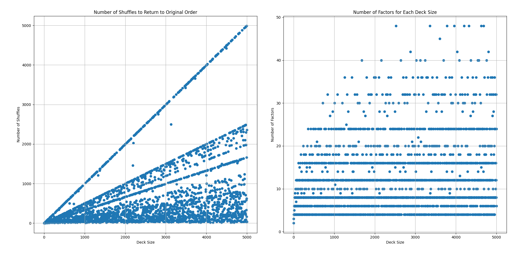

# Shuffle Analysis

## Description
This project analyzes the number of shuffles needed to return a deck to its original order and the number of factors for each deck size.


## Usage
Run the main script to generate the graphs:

```bash
python shuffle.py
```

## Results


